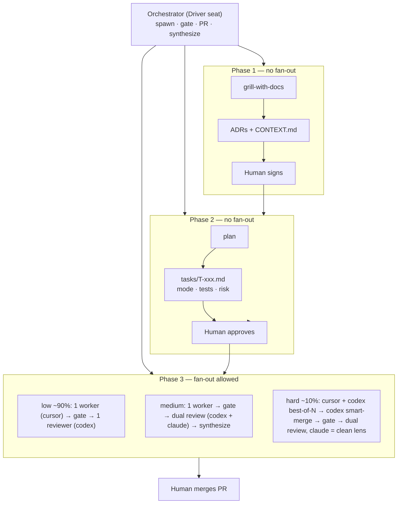

# agentic-workflow

A **portable agentic-coding conventions pack** — the **conventions, planning, and decisions** for agentic coding, *not* an orchestration engine. Distributed as portable **`SKILL.md` skills for Claude Code, Codex, and Cursor** (one symlink installer; ADR-0007), with an **optional Claude Code plugin** for the typed `/agentic-workflow:*` slash commands.

> Backbone: **`AGENTS.md` + a deterministic gate (CI) + git/PR isolation.**
> *LLMs propose. Tools verify. Git isolates. CI decides. Humans merge. Rules remember.*

The orchestration **engine** is an **external worktree manager** — currently **[Superset](https://github.com/superset-sh/superset)** (macOS app **plus** bundled CLI / SDK / MCP at `~/.superset/bin`). It's a *pluggable slot*: swap it for another manager (e.g. Claude Squad) in one line. **You drive the loop; a human merges.** This pack is the *operating manual + scaffolder* that sits on top. (See ADR-0002 for buy-the-engine / build-the-policy and the current pick.)

## What it gives you
*Each is a portable skill — invoke it in any seat (Claude Code, Codex, Cursor); the `/agentic-workflow:*` slash form is Claude-only sugar over the same skill.*
- **`/agentic-workflow:init`** — scaffold the baseline conventions into any repo.
- **`/agentic-workflow:architect`** — Phase 1: grill-with-docs → ADRs + CONTEXT (grill-me when no domain model yet).
- **`/agentic-workflow:plan`** — Phase 2: tasks with acceptance tests, `risk`, `mode`.
- **`/agentic-workflow:run`** — Phase 3: drive Superset; human merges.
- **`/agentic-workflow:review`** — the `medium`-tier dual review on a PR (two cross-lineage reviewers → synthesis; models in `docs/MODELS.md`).
- **`docs/adr/*`** — the decision record (the durable asset).
- **`docs/WORKFLOW.md`** — the one-page model.
- **`docs/ORCHESTRATOR_PLAYBOOK.md`** — the lived `/run` loop: spawn → verify → review → remediate → re-check → cleanup.
- **`docs/MODELS.md`** — the living table of which model runs which role/tier (revisit often).
- **`templates/`** — AGENTS.md, pre-commit, CLAUDE/.cursor, task template, agent biases.

## The loop (visual)
Three phases; humans gate planning; only Phase 3 fans out or touches `main`. The `low` tier is the ~90% path.

```
                         IDEA
                          │
   ┌──────────────────────▼─────────────────────────────┐
   │ 1. ALIGN — grill-with-docs vs ADRs + glossary       │ Phase 1 · 1 agent + human
   │    explore code, don't ask; stop when confused      │ → docs/adr/* + CONTEXT.md   ← HUMAN SIGNS each ADR
   └──────────────────────┬─────────────────────────────┘
   ┌──────────────────────▼─────────────────────────────┐
   │ 2. PLAN — tasks; acceptance = FROZEN red tests;     │ Phase 2 · 1 agent + human
   │    set mode (floor=low) · parallel-safe · risk      │ ← HUMAN APPROVES (primary control point)
   └──────────────────────┬─────────────────────────────┘
   ┌──────────────────────▼─────────────────────────────┐   ::: multi-agent opt-in #1 :::
   │ 3. IMPLEMENT (mode: low) — 1 worker, own worktree,  │←─ parallel-safe tasks → 1 worktree each
   │    smallest correct diff, commit (don't push)       │   ::: opt-in #2 (mode: hard, ~10%) :::
   │                                                     │←─ best-of-N over 2 lineages → codex smart-merge
   └──────────────────────┬─────────────────────────────┘   (claude held out = the clean reviewer)
   ┌──────────────────────▼─────────────────────────────┐
   │ 4. GATE — CI green (orchestrator runs it itself)    │   never pay to review red code
   └──────────────────────┬─────────────────────────────┘
   ┌──────────────────────▼─────────────────────────────┐   low: 1 cross-lineage reviewer (independent)
   │ 5. REVIEW — blockers only, ≤10 + minimalism lens    │   medium/hard: dual review → synthesis
   └──────────────────────┬─────────────────────────────┘   blockers → remediate → re-verify; cap 3 → needs-human
   ┌──────────────────────▼─────────────────────────────┐
   │ 6. HUMAN MERGES — small squash PR                   │   smart-merge ≠ auto-merge (ADR-0003)
   └──────────────────────┬─────────────────────────────┘
   ┌──────────────────────▼─────────────────────────────┐
   │ 7. LESSONS → GUARDRAILS                             │   recurring mistake → a test / lint / AGENTS.md rule
   └─────────────────────────────────────────────────────┘
```

The effort dial fans out only on **independence** (parallel-safe) or **competition** (`hard`); one independent reviewer always; humans merge:



## The exportability contract
**Engine = an external interactive manager (currently Superset). Policy/conventions = this plugin. Per-repo specifics = committed in the repo** (`AGENTS.md`, the gate, `tasks/`, ADRs). Nothing engine-level is copied per repo, so there is no drift — and the engine slot swaps without touching the conventions.

## Default posture
A per-task **effort/review dial — `mode: low | medium | hard`, default `low`** (prefer low, justify higher; ADR-0004). `low` = one implementer + deterministic gate + one adversarial reviewer. `medium` adds an independent dual review on every PR (two cross-lineage reviewers, synthesized). `hard` adds competitive best-of-N over **two lineages** + a **smart-merge** (synthesizes the attempts → one diff), then the cross-lineage dual review with **≥1 structurally-clean lens** — the third lineage is held out of authoring/synthesis to *be* that independent reviewer (**hard ⊇ medium**; the invariant is ADR-0004). **Which model runs each role/tier is a living table — `docs/MODELS.md`** (revisit often); the durable principle (role-keyed cost ladder, reviewers cross-lineage **and** independent of the implementer) is ADR-0004. When review raises blockers, a bounded **remediation loop** kicks in — the tier's implementer fixes the punch-list, excess findings escalate a tier + force a full re-review, capped at 3 rounds → else `needs-human` (ADR-0010). **Humans merge** at every tier — **smart-merge ≠ auto-merge**; autonomous auto-merge is the separate, orthogonal opt-in tier you graduate into (ADR-0003/0008), not implied by `hard`.

## Where it sits (vs other agentic-coding tools)
The field splits into **catalogs** (many agents/skills) and **policy** (how to work). This pack is the rare pure **policy/decisions** layer — it deliberately omits agent rosters and session-lifecycle hooks, which the survey itself flags as scale-out, not essential. Every system below converges on the same core loop (*align → freeze a plan → one isolated implementer → deterministic gate → one independent review → human merges → lessons become guardrails*); this pack is that core with the **fewest moving parts**, plus a cross-lineage review ladder and an explicit cost dial.

| Tool | Shape | Distinctive idea | License | Our stance |
|---|---|---|---|---|
| **→ agentic-workflow** | **policy/decisions** (8 skills · 11 ADRs) | **ADRs as the asset; engine swappable; effort dial; cross-lineage independence invariant; risk floor** | **MIT** | — |
| [obra/superpowers](https://github.com/obra/superpowers) | process + skills | fresh subagent per task; parallel-implementation flagged as a risk; skills-that-write-skills | MIT | **Closest cousin.** Validates our sequential-default; we add lineage independence + ADR governance |
| [mattpocock/skills](https://github.com/mattpocock/skills) | composable skills | anti-framework: small skills, dev keeps control | MIT | **Upstream** of our `grill-me`/`grill-with-docs` (vendored, credited). Borrow `diagnose`/`zoom-out` into your *global* toolkit, not the pack |
| [DietrichGebert/ponytail](https://github.com/DietrichGebert/ponytail) | minimalism rule-pack | 6-rung ladder + floor; debt markers | MIT | **Imported the philosophy** (ADR-0011: ladder + `SHORTCUT(…)`); declined the hook-injected delivery (ADR-0001) |
| [anthropics/skills](https://github.com/anthropics/skills) | spec + examples | canonical `SKILL.md` format; progressive disclosure | Apache-2.0 | **Format ground truth** — we comply (`name`==folder, `description` triggers) |
| [open-gsd/gsd-core](https://github.com/open-gsd/gsd-core) | methodology | context-rot thesis; wave parallelism; thin orchestrator | — | Borrow: name the context-rot principle. **Skip `STATE.md`** (duplicates git — AW-0001) |
| [garrytan/gstack](https://github.com/garrytan/gstack) | workflow + catalog | virtual eng team; `/office-hours` → `/ship` | MIT | Borrow the `/review` + `/qa` ideas; **skip** the 23-role explosion |
| [affaan-m/ECC](https://github.com/affaan-m/ECC) | harness OS | hooks, memory, 268 skills, orchestrators | — | **Reference architecture, not adopted** — hooks/memory conflict with rules-in-repo (AW-0001) |
| [wshobson/agents](https://github.com/wshobson/agents) | catalog | description-as-router; per-agent model tier | — | Borrow per-agent model tiers (we centralize in `docs/MODELS.md`); **skip** the catalog |
| [multica-ai/andrej-karpathy-skills](https://github.com/multica-ai/andrej-karpathy-skills) | 1 rule-pack | think-before-coding; simplicity; surgical edits | MIT | Principles already embedded via ADR-0011 |
| [shanraisshan/claude-code-best-practice](https://github.com/shanraisshan/claude-code-best-practice) | encyclopedia | convergence index of the field | MIT | An index to read, not a workflow to adopt |

**What we deliberately don't add** (the survey validates the restraint): session-lifecycle hooks, 100+-agent rosters, a process-owning framework, or auto-merge by default (it's the earned, opt-in ADR-0008 tier). Leanness is the feature.

## Requirements
Claude Code · the official CLIs logged in on your subs (`claude`, `codex`, `cursor-agent`) · `gh` · [Superset](https://github.com/superset-sh/superset/releases/latest) (macOS; CLI bundled in the app) for the engine.

## Install
Per seat (once per machine), symlink this repo's skills into every CLI's global skill dir (`~/.agents/skills`, `~/.codex/skills`, `~/.claude/skills`):

```bash
bash bin/install.sh
```

Re-run after pulling skill updates — the script is idempotent (`ln -sfn`).
